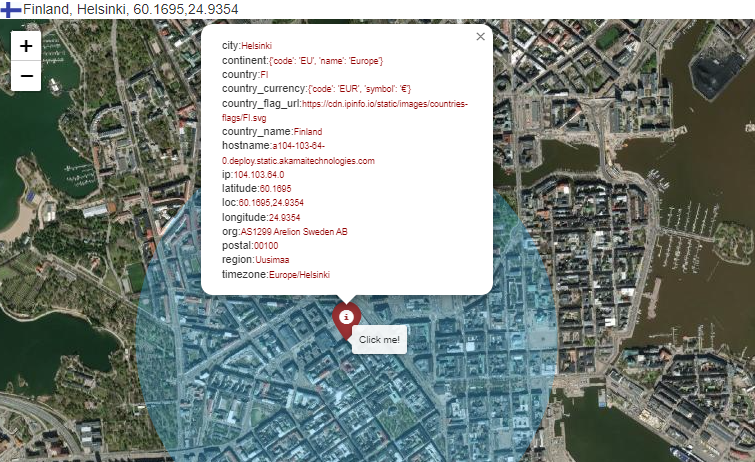

# IP Geolocation

Using the IPinfo.io API, I fetch detailed information about the target IP, including its city, region, country, and geographical coordinates (latitude and longitude). IPinfo.io API, Retrieving IP Details:
`get_ip_details('45.33.32.156')`
```console
{'ip': '45.33.32.156',
 'hostname': 'scanme.nmap.org',
 'city': 'Fremont',
 'region': 'California',
 'country': 'US',
 'loc': '37.5483,-121.9886',
 'org': 'AS63949 Akamai Connected Cloud',
 'postal': '94536',
 'timezone': 'America/Los_Angeles',
 'country_name': 'United States',
 'isEU': False,
 'country_flag_url': 'https://cdn.ipinfo.io/static/images/countries-flags/US.svg',
 'country_flag': {'emoji': '🇺🇸', 'unicode': 'U+1F1FA U+1F1F8'},
 'country_currency': {'code': 'USD', 'symbol': '$'},
 'continent': {'code': 'NA', 'name': 'North America'},
 'latitude': '37.5483',
 'longitude': '-121.9886'}
```
## Resolving Domain Names
To discover the IP address of a given domain, I explored two ways for obtaining the IP address of a domain:

* **nmap**: By performing a list scan (-sL), I obtain the IP address associated with the domain. This method, while effective, is slower. `get_ip_from_domain_with_nmap(scanme.nmap.org)` ➔ <b>45.33.32.156</b>.
  
* **Socket**: This method performs a DNS lookup to quickly resolve the domain name to an IP address. `get_ip_from_domain_with_socket(scanme.nmap.org)` ➔ <b>45.33.32.156</b>.

## Folium Map
[MyMaps](https://damakes.github.io/port-scanning-ip-geolocation/)
 



Folium maps display the location of the IP address with markers and circles. I also included a popup with detailed information such as city, region, country, and other relevant data. The map is saved as an HTML file, but can be viewd directly within the notebook in desktop.
[IP_Geolocation.ipynb](/IP_Geolocation.ipynb)

#### [REFERENCES](References.md)
