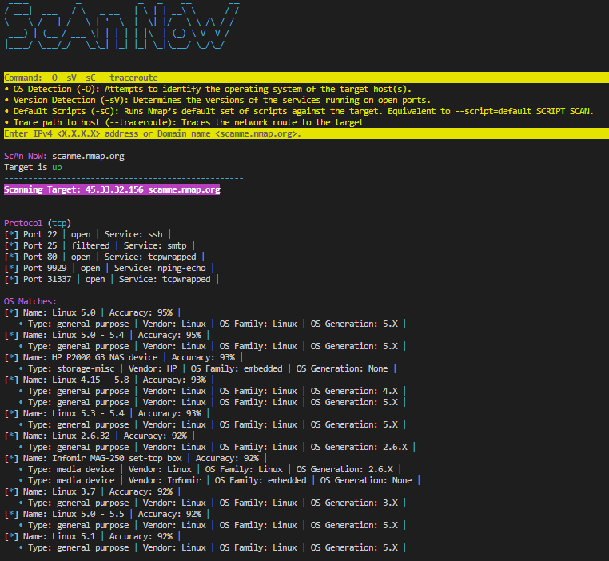

# Port Scanner
Script performs a scan to IP address or Domain name, using arguments '-O -sV -sC --traceroute'.

| Argument      | Description                                                                 |
|---------------|-----------------------------------------------------------------------------|
| **-O**        | Enable OS detection.                                                         |
| **-sV**       | Probe open ports to determine service and version information.               |
| **-sC**       | Equivalent to `--script=default` (runs Nmap's default set of scripts).        |
| **--traceroute** | Traces the network route to the target.                                     |

Displays the status of the target, whether it is up or down. 
Lists and describes the protocols and ports in use on the target.
Shows the operating system details, if available.
Displays the results of host scripts executed by Nmap.
Shows the network route details, if available.

Banner is created using [pyfiglet library](https://github.com/pwaller/pyfiglet). 
In the modules folder, there is a [TextColors.py](/modules/text_colors.py) file, which is used to display color-coded outputs in the terminal. [scan_now.py](/scan_now.py)

#### [REFERENCES](References.md)